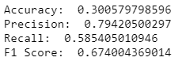

# Disaster Response Pipeline Project

### Project Motivation:

In this project. I made use of the data engineering concepts to analyze labelled disaster messages received from all over the world during disasters and used Machine Learning pipeline to build a supervised machine learning model that categorizes each message into 36 of the categories. It is multi-label classification problem. The data is made available by Figure Eight.

I first build an ETL pipeline that processes messages and category data from CSV files and load them into SQLite database.

The datasets used contain real messages that were sent during disaster events. I then created a machine learning pipline to categorize these event to reach out for a relevant relief agency.

Finally, I created a web app that will extract data from this database to provide data visualisations. I also used my model to classify new messages into categories on entering messages into the web app.

### File Structure:

	- app
	| - template
	| |- master.html  # main page of web app
	| |- go.html  # classification result page of web app
	|- run.py  # Flask file that runs app

	- data
	|- disaster_categories.csv  # data to process 
	|- disaster_messages.csv  # data to process
	|- process_data.py
	|- DisasterResponse.db   # database to save clean data to

	- models
	|- train_classifier.py
	|- classifier.pkl  # saved model 

	- README.md

### Instructions:
1. Run the following commands in the project's root directory to set up your database and model.

    - To run ETL pipeline that cleans data and stores in database
        `python data/process_data.py data/disaster_messages.csv data/disaster_categories.csv data/DisasterResponse.db`
    - To run ML pipeline that trains classifier and saves
        `python models/train_classifier.py data/DisasterResponse.db models/classifier.pkl`

2. Run the following command in the app's directory to run your web app.
    `python run.py`

3. Go to http://0.0.0.0:3001/

### ETL Pipeline:

We first extracted the data from two given files "messages.csv" and "categories.csv". We then performed the following transformation:
	
   - perform cleaning operations such as expanding the multiple categories into seperate columns, extract categories values, replace the previous categories with new columns and removing duplicates and null values
	
   - We also cleaned the 'Related' category column as instead of two values (0 & 1), it had three values (0, 1 & 2). We replaced 2 with 1 after doing some analysis.
	
Finally, after transformation we load the data into a sqlite database.

### ML Pipeline:

1. First, we loaded the data from sqlite database that was prepared in the ETL step and generate features (X) and labels (Y).
2. We defined a tokenize() that performs lower case, removes punctuations, stopwords, tokenizes and then finally lemmatizes and returns the list of cleaned tokens in the message.
3. We then create a ML Pipeline using scikit learn library. The pipeline consists of:
	- Tfidf Vectorizer with tokenizer defined as above.
	- LogisticRegression() as the ML model
	- Used MultiOutputClassifier that trains seperate model for each label. Used in multilabel classification problem.
	
	- Model Output
	
	
	
We have used micro-averaged F1 score as our metric as it is the best in case of multi-label classification.

### Output:

#### 1. Visualisation Example

#### 2. Classify Tweets Example 

Type a message such as: Hurricane lead to water and food shortage in costa rica

### Future improvements :
  - We can achieve good accuracy by using the algorithm like LSTM with word embedding.
  - Better pre-processing techniques can be used.
  - We can do upsampling or undersampling to account for imbalance in the dataset
